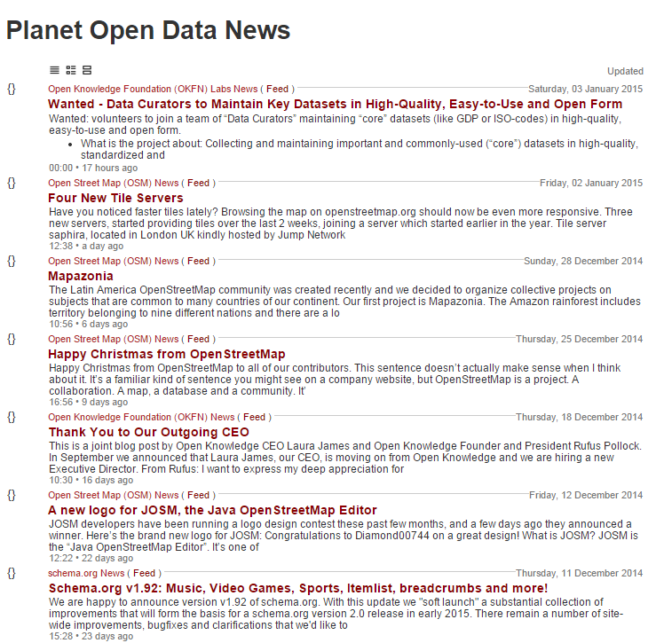

# `news` -  Pluto Planet Template Pack "River of News"

## What's Pluto?

Pluto is a feed reader that lets you build web pages from published
web feeds. More [Pluto Project Site »](http://feedreader.github.io)

## Screenshot - Preview

## Usage

### Try It Yourself - How To Use the "River of News" Template Pack

If you want to try it yourself, install (fetch) the new template pack. Issue the command:

    $ pluto install news

Or as an alternative clone the template pack using `git`. Issue the commands:

    $ cd ~/.pluto
    $ git clone git://github.com/planet-templates/planet-news.git

To check if the new template got installed, use the `list` command:

    $ pluto list

Listing something like:

    Installed templates include:
       top (~/.pluto/news/news.txt)

Showtime! Let's use the `-t/--template` switch to build a sample Planet Ruby. Example:

     $ pluto build ruby.yml --template news     or
     $ pluto b ruby -t news

Open up the generated planet page `ruby.news.html` in your browser. Voila. That's it.

## License

The `pluto` scripts are dedicated to the public domain.
Use it as you please with no restrictions whatsoever.

## Questions? Comments?

Send them along to the [Planet Pluto and Friends Forum/Mailing List](http://groups.google.com/group/feedreader).
Thanks!
